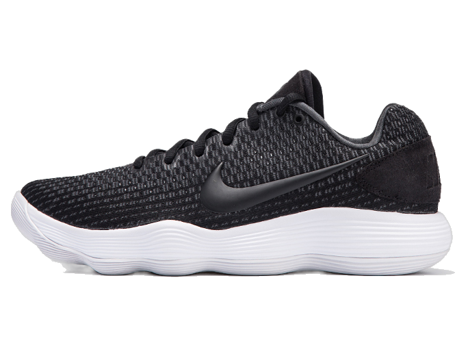

# Carve/tracer_b7Cog model

This is an implementation of the [Carve/tracer_b7](https://huggingface.co/Carve/tracer_b7) as a Cog model. [Cog packages machine learning models as standard containers.](https://github.com/replicate/cog)

First, download the pre-trained weights:

    cog run script/download-weights

Then, you can run predictions:

    cog predict -i image=@shoe.jpg

## Example

Input shoe image

Output shoe image with background removed

